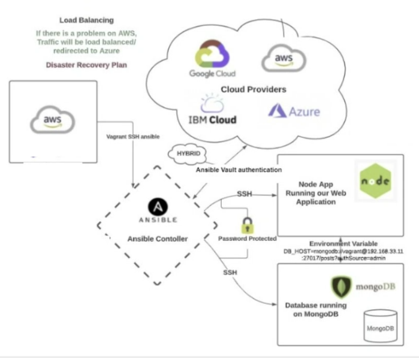

# Infrastructure as Code


## What is Infrastructure as Code? 
Infrastructure as code (IaC) is a way of managing and provisioning infrastructure, such as servers, networks, storage, and databases, through code instead of manual processes. With IaC, you can define your infrastructure specifications in configuration files that are easy to edit and distribute. You can also use automation tools to apply those specifications to your target environments, ensuring that they are always consistent and up-to-date. IaC is a key practice of DevOps, as it enables faster and more reliable delivery of applications and their supporting infrastructure.

### Some of the benefits of IaC are:

* It reduces human errors and configuration drifts that can cause deployment issues or runtime failures.
* It improves efficiency and productivity by automating repetitive and time-consuming tasks.
* It enhances collaboration and transparency by using version control and code reviews for infrastructure changes.
* It supports scalability and flexibility by allowing you to provision or deprovision resources on demand.

<br>

## Configuration Management

Configuration management is the process of setting up and maintaining the properties and behavior of the infrastructure components, such as servers, networks, storage, and databases. Configuration can include aspects such as installing software packages, setting up user accounts, configuring security policies, managing network connections, and so on. Configuration can be done manually or automatically through code.

With infrastructure as code (IaC), configuration is done through code instead of manual processes. This means that you can define your configuration specifications in configuration files that are easy to edit and distribute. You can also use automation tools to apply those specifications to your target environments, ensuring that they are always consistent and up-to-date. Configuration management is a key aspect of IaC, as it helps you to avoid configuration drifts or missing dependencies that can cause deployment issues or runtime failures.

Some examples of configuration management tools are:

* **Ansible**: An open source platform that automates infrastructure provisioning, configuration management, application deployment, and orchestration. Ansible uses a declarative language called YAML to define configuration as code.
* **Chef**: An open source tool that automates the delivery and operation of software across its entire lifecycle. Chef uses a declarative language called Ruby DSL to define configuration as code.
* **Puppet**: An open source tool that automates the delivery and operation of software across its entire lifecycle. Puppet uses a declarative language called Puppet DSL to define configuration as code.
* **PowerShell**: A cross-platform scripting language and shell that enables you to automate tasks and manage systems. PowerShell uses an imperative language called PowerShell Scripting Language to define configuration as code.

<br>

## Orchestration

Orchestration is the process of *coordinating multiple automation tasks*. It can be used to create complex and streamlined workflows that involve different types of resources, such as servers, networks, storage and databases. Orchestration can help to achieve higher efficiency, scalability and reliability in infrastructure management.

One of the aspects of infrastructure as code (IaC) is Orchestration. With IaC, you can use Orchestration tools to automate the creation and configuration of infrastructure components across different environments and platforms. 

### Some examples of orchestration tools are:

* **Terraform**: An *open source tool* that enables you to create, change, and manage infrastructure across multiple cloud providers. Terraform uses a declarative language called HCL to define infrastructure as code.

* **Ansible**: An *open source platform* that automates infrastructure provisioning, configuration management, application deployment, and orchestration. Ansible uses a declarative language called YAML to define infrastructure as code.

* **Kubernetes**: An open source system that automates the deployment, scaling, and management of containerized applications. Kubernetes uses a declarative language called YAML to define infrastructure as code.

* **AWS CloudFormation**: A service that provides a common language for you to model and provision AWS and third-party application resources in your cloud environment. AWS CloudFormation uses a declarative language called JSON or YAML to define infrastructure as code.

<br>



### **Our Architecture of Configuration Management using Infrastructure as Code with Ansible** (diagram breakdown):
* Local Host (on-prem: Vagrant) or on the cloud (AWS)
* We can use SSH as authentication process or password (usually provided by the client)
* We set up a controller: **Ansible** (using Vagrant or AWS) will control the **Agent Node(s)** and it can install all dependencies for us automatically, change the IP, run updates, restart etc.
* Expected Nodes: **App VM** and a **DB VM**
* We will automate and codify using IaC.

<br>

## Steps:

1. Spin up an Instance (with 'ami-0136ddddd07f0584f' AMI). This will be the Ansible Controller instance.

2. Run the updates:

```shell
sudo apt update

sudo apt upgrade -y
```

3. Install `software-properties-common` and add the Ansible location:

```shell
sudo apt install software-properties-common

sudo apt-add-repository ppa:ansible/ansible

# Press Enter
```

4. Update the system and Install Ansible:

```shell
sudo apt update -y

sudo apt install ansible -y

ansible --version
```

5. Check the location of Ansible:

```shell
cd /etc/ansible/

#optional, you can install tree for a nicer view
sudo apt install tree
tree
```


6. On a new Git Bash window, copy the .pem file:
```shell
scp -i "~/.ssh/tech254.pem" ~/.ssh/tech254.pem ubuntu@<<Public Instance IP>>:~/.ssh
```

7. Back in your Instance Bash connection, check it has been saved:

```shell
cd ~/.ssh
tree
```

8. Create an AMI from the Ansible Controller instance, then spin up 2 new Instances, 'ansible_app' and 'ansible_db' which will be our app and database instances.

9. In the 2 new instances, run the updates.

```shell
sudo apt update
sudo apt upgrade -y
```

10. Next, go to that separate Git Bash window and for each instance, copy the .pem file:

```shell
scp -i "~/.ssh/tech254.pem" ~/.ssh/tech254.pem ubuntu@<<Public Instance IP>>:~/.ssh
```

<br>

Sources:
- [What is IaC - Microsoft](https://learn.microsoft.com/en-us/devops/deliver/what-is-infrastructure-as-code)
- [What is IaC - RedHat](https://www.redhat.com/en/topics/automation/what-is-infrastructure-as-code-iac)
- [IaC - wiki](https://en.wikipedia.org/wiki/Infrastructure_as_code)
- [What is Configuration Management - Redhat](https://www.redhat.com/en/topics/automation/what-is-configuration-management)
- [Configuration Management - wiki](https://en.wikipedia.org/wiki/Configuration_management)
- [Infrastructure Configuration - code academy](https://www.codecademy.com/article/infrastructure-configuration)
- [IaC Configuration management - devopscube.com](https://devopscube.com/infrastructure-as-code-configuration-management/)
- [IaC Guide - turing.com](https://www.turing.com/blog/infrastructure-as-code-iac-guide/)