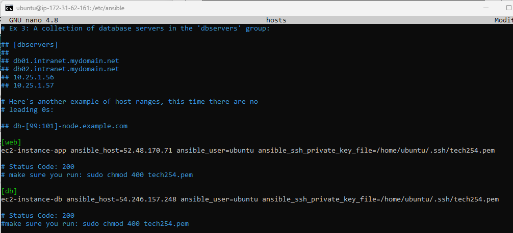
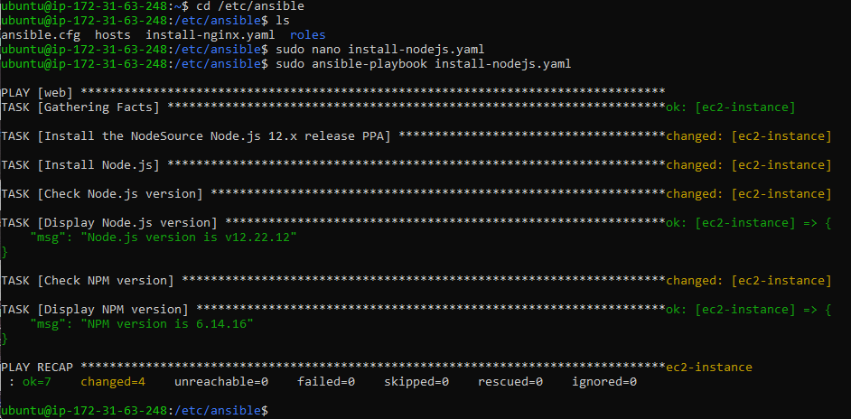

# Infrastructure as Code


## What is Infrastructure as Code? 
Infrastructure as code (IaC) is a way of managing and provisioning infrastructure, such as servers, networks, storage, and databases through code instead of manual processes. With IaC, you can define your infrastructure specifications in configuration files that are easy to edit and distribute. You can also use automation tools to apply those specifications to your target environments, ensuring that they are always consistent and up-to-date. IaC is a key practice of DevOps, as it enables faster and more reliable delivery of applications and their supporting infrastructure.

### Some of the benefits of IaC are:

* It reduces human errors and configuration drifts that can cause deployment issues or runtime failures.
* It improves efficiency and productivity by automating repetitive and time-consuming tasks.
* It enhances collaboration and transparency by using version control and code reviews for infrastructure changes.
* It supports scalability and flexibility by allowing you to provision or deprovision resources on demand.

<br>

## Configuration Management

Configuration management is **the process of setting up and maintaining the properties and behavior of the infrastructure components** such as servers, networks, storage and databases. Configuration can include aspects such as installing software packages, setting up user accounts, configuring security policies, managing network connections and so on. Configuration can be done manually or automatically through code.

With infrastructure as code (IaC), **configuration is done through code instead of manual processes**. This means that you can define your configuration specifications in configuration files that are easy to edit and distribute. You can also use automation tools to apply those specifications to your target environments, ensuring that they are always consistent and up-to-date. Configuration management is a key aspect of IaC, as it helps you to avoid configuration drifts or missing dependencies that can cause deployment issues or runtime failures.

Some examples of configuration management tools are:

* **Ansible**: An *open source platform* that automates infrastructure provisioning, configuration management, application deployment, and orchestration. Ansible uses a declarative language called YAML to define configuration as code.
* **Chef**: An *open source tool* that automates the delivery and operation of software across its entire lifecycle. Chef uses a declarative language called Ruby DSL to define configuration as code.
* **Puppet**: An *open source tool* that automates the delivery and operation of software across its entire lifecycle. Puppet uses a declarative language called Puppet DSL to define configuration as code.
* **PowerShell**: A *cross-platform scripting language and shell* that enables you to automate tasks and manage systems. PowerShell uses an imperative language called PowerShell Scripting Language to define configuration as code.

<br>

## Orchestration

Orchestration is the process of *coordinating multiple automation tasks*. It can be used to create complex and streamlined workflows that involve different types of resources, such as servers, networks, storage and databases. Orchestration can help to achieve higher efficiency, scalability and reliability in infrastructure management.

With IaC, you can use Orchestration tools to **automate the creation and configuration of infrastructure components** across different environments and platforms. 

### Some examples of orchestration tools are:

* **Terraform**: An *open source tool* that enables you to create, change, and manage infrastructure across multiple cloud providers. Terraform uses a declarative language called HCL to define infrastructure as code.

* **Ansible**: An *open source platform* that automates infrastructure provisioning, configuration management, application deployment, and orchestration. Ansible uses a declarative language called YAML to define infrastructure as code.

* **Kubernetes**: An *open source system* that automates the deployment, scaling, and management of containerized applications. Kubernetes uses a declarative language called YAML to define infrastructure as code.

* **AWS CloudFormation**: A *service* that provides a common language for you to model and provision AWS and third-party application resources in your cloud environment. AWS CloudFormation uses a declarative language called JSON or YAML to define infrastructure as code.

### Why we are using Terraform for Orchestration:
Terraform is a powerful tool for managing infrastructure that provides *a high-level view of the infrastructure* and allows for easy incremental changes. It is **particularly well-suited for complex tasks** such as *provisioning multi-cloud, configuring environments and clusters*. 

Terraform also has **a modular design**, is simple and easy-to-learn and maintains the state of the resources created. It allows import of existing resources to bring them in Terraform state and has **seamless integration with CI/CD pipelines**. 

<br>


### **Our Architecture of Configuration Management using Infrastructure as Code with Ansible** (diagram breakdown):
* Local Host (on-prem: Vagrant) or on the cloud (AWS)
* We can use SSH as authentication process or password (usually provided by the client)
* We set up a controller: **Ansible** (using Vagrant or AWS) will control the **Agent Node(s)** and it can install all dependencies for us automatically, change the IP, run updates, restart etc.
* Expected Nodes: **App VM** and a **DB VM**
* We will automate and codify using IaC.

<br>


## Why Ansible?
To put it in the simplest terms, **Ansible lets you do things remotely that you would otherwise do at the command line**. Specifically, it's used to *install software and change system settings*. It puts a machine into the state in which you want it to remain and keeps it there. 

Ansible is a powerful tool that can help you automate various tasks related to IT infrastructure and application deployment. Some of the benefits of using Ansible are:

* It is **simple and easy to use**: it uses *a human-readable language called YAML* to write playbooks, which are files that define the desired state and actions of the managed systems. 

* It is **agentless and secure**: does not require any agents or daemons to be installed on the managed nodes, which reduces the overhead and complexity of managing them.

* It is **cross-platform and compatible**: can manage systems running on various operating systems, such as Linux, Windows, MacOS, FreeBSD etc. 

* It is **modular and extensible**: has a large collection of modules that can perform various tasks, such as installing software, configuring system settings, managing users and groups etc. 

<br>


## Yaml
YAML is *a data serialization language* that is designed to be human-readable and easy to use. It is often used for configuration files and data exchange between applications. YAML stands for **Yet Another Markup Language** (or **YAML Ain’t Markup Language**), which means that it is not intended for creating documents like HTML or XML, but rather for representing data structures like lists, maps, scalars etc.

#### **Yaml** is used in *Ansible, Kubernetes, Docker, OpenStack, Swagger* and many others.

### Some of the features of YAML are:

* It uses indentation to indicate the level of nesting of data elements.
* It supports both basic data types (such as strings, numbers, booleans etc) and complex data types (such as sequences, mappings, sets etc).
* It allows custom data types and tags to extend the standard data types.
* It can represent multiple documents in a single file using the document separator `---`.
* It can include comments using the `#` symbol.
* It can use anchors and aliases to reuse data elements within a document.
* It can use references to external files using the `!include` tag.


### Very important: `Indentation matters!` - do not use tab, always use 2 spaces.

<br>


## Steps:

1. Spin up an Instance (with 'ami-0136ddddd07f0584f' AMI). This will be **the Ansible Controller instance**.

2. Run the updates:

```shell
sudo apt update && sudo apt upgrade -y
```

3. Install `software-properties-common` and add the Ansible location:

```shell
sudo apt install software-properties-common

sudo apt-add-repository ppa:ansible/ansible

# Press Enter
```

4. Update the system and Install Ansible:

```shell
sudo apt update -y

sudo apt install ansible -y

ansible --version
```

5. Check the location of Ansible:

```shell
cd /etc/ansible/

#optional, you can install tree for a nicer view
sudo apt install tree
tree
```


6. On a new Git Bash window, copy the .pem file:
```shell
scp -i "~/.ssh/tech254.pem" ~/.ssh/tech254.pem ubuntu@<<Public Instance IP>>:~/.ssh
```

7. Back in your Instance Bash connection, check it has been saved:

```shell
cd ~/.ssh
tree
```

8. Create an AMI from the Ansible Controller instance, then spin up 2 new Instances, 'ansible_app' and 'ansible_db' which will be our app and database instances.

9. In the 2 new instances, run the updates.

```shell
sudo apt update && sudo apt upgrade -y
```

10. Next, go to that separate Git Bash window and for each instance, copy the .pem file:

```shell
scp -i "~/.ssh/tech254.pem" ~/.ssh/tech254.pem ubuntu@<<Public Instance IP>>:~/.ssh
```

11. Don't forget to change the permissions for the key:

```shell
sudo chmod 400 tech254.pem
```

You can check permissions with:

```shell
ls -l 

# alternatively:
ll 
```

12. Next we will add the App instance IP to `hosts` so we can access the App Instance. We will modify the `hosts` file:

```shell
# go back to etc/ansible if you have changed directories
cd /etc/ansible/

# modify file 'hosts'; this is where you add IPs to access.
sudo nano hosts
```


At the end of the file, add:

```shell

[web]
ec2-instance ansible_host=APP-PUBLIC-IP ansible_user=ubuntu ansible_ssh_private_key_file=/home/ubuntu/.ssh/tech254.pem
# Status Code is: 200
#make sure you run: sudo chmod 400 tech254.pem

```


13. To check it was saved correctly:

```shell
# Telling Ansible to ping this endpoint
sudo ansible web -m ping
```


14. Getting details of the Instance OS:

```shell
sudo ansible web -a "uname -a"
```


15. You can also find out where the instance is running:

```shell
# find where it's running
sudo ansible web -a "date"
```


16. Add the database IP to hosts:



17. Ping both of the instances:


<br>


## Ansible Playbooks

Ansible Playbooks offer **a repeatable, re-usable, simple configuration management and multi-machine deployment system**, one that is well suited to deploying complex applications. If you need to execute a task with Ansible more than once, write a playbook and put it under source control. Then you can use the playbook to push out new configuration or confirm the configuration of remote systems. 

Playbooks are expressed in **YAML format** with a minimum of syntax. 
A playbook is composed of one or more 'plays' in an ordered list. The terms *'playbook' and 'play' are sports analogies*. Each play executes part of the overall goal of the playbook, running one or more tasks. **Each task calls an Ansible module**.

Playbooks can:
* declare configurations
* orchestrate steps of any manual ordered process, on multiple sets of machines, in a defined order
* launch tasks synchronously or asynchronously

<br>

### a) Install-nginx Playbook

1. Creating and editing **the Install-nginx Playbook**:

```shell
# needs to be in the default location: /etc/ansible

sudo nano install-nginx.yaml 
# '.yml' works too
```

2. Add the following commands:

```shell
# Creating a Playbook to provision nginx Web Server in the web-node

---
# Yaml file starts with 3 dashes

# Where do you want to install or run this playbook
- hosts: web

# find the facts - see the logs (optional)
  gather_facts: yes

# provide admin access to this playbook (telling it to use sudo)
  become: true

# provide the actual instructions - install nginx
  tasks:
  - name: provision/install/configure Nginx
    apt: pkg=nginx state=present
# ensuring nginx is running/enabled

```


3. To run the Install-nginx Playbook:

```shell
# Running the playbook
sudo ansible-playbook install-nginx.yaml
```


4. Check the status:

```shell 
sudo ansible web -a "sudo systemctl status nginx"
```


<br>

### b) Install-node.js Playbook

1. Creating and editing **the Install-node.js Playbook**:

```shell
# needs to be in the default location: /etc/ansible
sudo nano install-nodejs.yaml
```

2. Add the following commands:

```shell
# Creating a Playbook to provision node.js

---
# Yaml file starts with 3 dashes

# Where do you want to install or run this playbook
- hosts: web

# find the facts - see the logs (optional)
  gather_facts: yes

# provide admin access to this playbook (telling it to use sudo)
  become: true

# provide the actual instructions - install node.js
  tasks:
  - name: Install the NodeSource Node.js 12.x release PPA
    shell: "curl -sL https://deb.nodesource.com/setup_12.x | bash -"

  - name: Install Node.js
    apt:
      name: nodejs
      state: present

  - name: Check Node.js version
    shell: "node -v"
    register: node_version

  - name: Display Node.js version
    debug:
      msg: "Node.js version is {{ node_version.stdout }}"

  - name: Check NPM version
    shell: "npm -v"
    register: npm_version

  - name: Display NPM version
    debug:
      msg: "NPM version is {{ npm_version.stdout }}"

```


3. To run the Install-node.js Playbook:

```shell
# Running the playbook
sudo ansible-playbook install-nodejs.yaml
```



<br>

### c) mongoDB-setup Playbook

1. Creating and editing **the mongoDB Playbook**:

```shell
sudo nano mongo-playbook.yaml
```

2. Add the following commands:

```shell

# This Playbook will set up MongoDB in the DB EC2

---

# Agent node name/IP

- hosts: db

# Gather Facts
  gather_facts: yes

# Provide admin access
  become: true

# Provide Instructions
  tasks:
  - name: set up mongodb indb ec2
    apt: pkg=mongodb state=present

# Ensure DB is in a running state by saying 'present'. If not, you can type 'absent'
```


3. To run the mongo Playbook:

```shell
sudo ansible-playbook mongo-playbook.yaml
```


<br>

### d) mongoDB Bind-IP-Change Playbook

1. Creating and editing **change-bindip.yaml Playbook**:

2. Add the following commands:

```shell
# This Playbook will Configure BindIP to accept requests from 0.0.0.0

---

# Agent node name/IP

- hosts: db

# Gather Facts
  gather_facts: yes

# Provide admin access
  become: true

# Provide Instructions
  tasks:
  - name: Update BindIP in the mongod.conf file
    replace:
      path: /etc/mongodb.conf
      regexp: 'bind_ip = 127.0.0.1'
      replace: 'bind_ip = 0.0.0.0'
```


If you want, instead of using ad-hoc commands, you can also add restart and enable MongoDB to the playbook:

```shell
  - name: Restart MongoDB Service
    service:
      name: mongodb
      state: restarted

  - name: Enable MongoDB Service on Boot
    service:
      name: mongodb
      enabled: yes
```

3. To run the change-bindip Playbook:

```shell
sudo ansible-playbook change-bindip.yaml
```

4. Checking the change to the `mongodb.conf` file:


<br>

### After running all the Playbooks: 

1. Restarting MongoDB and checking the status:

```shell
sudo ansible db -a "sudo systemctl restart mongodb"

sudo ansible db -a "sudo systemctl enable mongodb"

sudo ansible db -a "sudo systemctl status mongodb"
```


2. Go to your App Instance and export the DB IP:

```shell
export DB_HOST=mongodb://54.246.157.248:27017/posts
```

3. Restart the App. 

```shell
pm2 kill
pm2 start app.js
```


<br>

### Useful command

Don't forget, if you want to leave an instance you've accessed through SSH, simply:

```shell
exit
```

You can also put the key in the `root` directory:


<br>

Sources:
- [What is IaC - Microsoft](https://learn.microsoft.com/en-us/devops/deliver/what-is-infrastructure-as-code)
- [What is IaC - RedHat](https://www.redhat.com/en/topics/automation/what-is-infrastructure-as-code-iac)
- [IaC - wiki](https://en.wikipedia.org/wiki/Infrastructure_as_code)
- [What is Configuration Management - Redhat](https://www.redhat.com/en/topics/automation/what-is-configuration-management)
- [Configuration Management - wiki](https://en.wikipedia.org/wiki/Configuration_management)
- [Infrastructure Configuration - code academy](https://www.codecademy.com/article/infrastructure-configuration)
- [IaC Configuration management - devopscube.com](https://devopscube.com/infrastructure-as-code-configuration-management/)
- [IaC Guide - turing.com](https://www.turing.com/blog/infrastructure-as-code-iac-guide/)
- [Yaml - wiki](https://en.wikipedia.org/wiki/YAML)
- [RedHat - Yaml](https://www.redhat.com/en/topics/automation/what-is-yaml)
- [Reasons for Ansible - RedHat](https://developers.redhat.com/articles/2021/09/27/four-reasons-developers-should-use-ansible)
- [Ansible.com](https://www.ansible.com/overview/how-ansible-works)
- [Ansible Docs](https://docs.ansible.com/ansible/latest/playbook_guide/playbooks_intro.html)