# Terraform

**Terraform** = An *open source tool* that enables you to create, change and manage infrastructure across multiple cloud providers. Terraform uses a declarative language called HCL to define infrastructure as code.

<br>

### Why we are using Terraform for Orchestration:
Terraform is a powerful tool for managing infrastructure that provides *a high-level view of the infrastructure* and allows for easy incremental changes. It is **particularly well-suited for complex tasks** such as *provisioning multi-cloud, configuring environments and clusters*. 

Terraform also has **a modular design**, is simple and easy-to-learn and maintains the state of the resources created. It allows import of existing resources to bring them in Terraform state and has **seamless integration with CI/CD pipelines**. 

<br>

### Who is using Terraform?
Terraform supports a number of cloud infrastructure providers such as Amazon Web Services, Cloudflare, Microsoft Azure, IBM Cloud, Serverspace, Selectel Google Cloud Platform, DigitalOcean, Oracle Cloud Infrastructure, Yandex.

<br>

## Steps:

1. First, install Terraform. Download the Terraform executable: [Terraform](https://developer.hashicorp.com/terraform/downloads)

2. Extract the downloaded .zip file to the directory of your choosing to place the `terraform.exe` executable on your machine (an easy to access location is `C:\terraform\`).

3. Update the System's global path to include the location of the Terraform executable to make it available from anywhere. [Guide](https://build5nines.com/install-terraform-on-windows-for-use-in-command-prompt-and-powershell/#update-system-global-path)

4. Verify the Terraform version: 

```shell
terraform --version
```
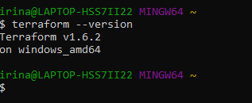

5. Create a directory for Terraform.

```shell
mkdir tech254-terraform
cd tech254-terraform
```

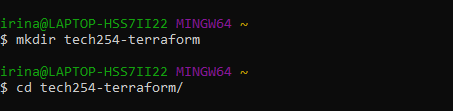

6. View Terraform options:

```shell
terraform
```
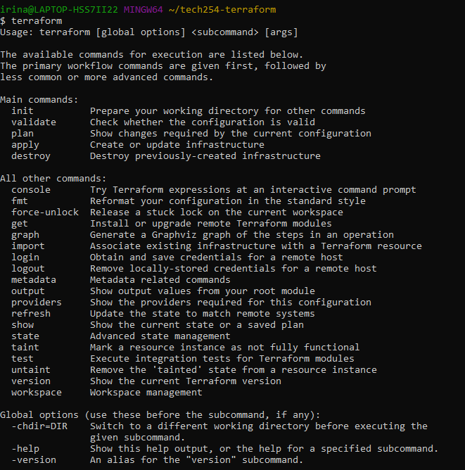

7. `main.tf` is the default file for Terraform (this will contain the Infrastructure Code):

```shell
nano main.tf
```
* Indentation doesn't matter here. 
* Does not need to be called `main` as long as it has `.tf` extension. `main.tf` is simply the recommended convention.
* It's the entrypoint, it helps us communicate with the rest of the world. 
* Everything is a resource in terms of syntax.

```shell
# Who is the provider
provider "aws" {

# Location of AWS
  region = "eu-west-1"

}

# To download required dependencies

# Create a service/resource on the cloud - EC2 on AWS

resource "aws_instance" "irina-iac-test" {
   ami = "ami-0943382e114f188e8"
   instance_type = "t2.micro"
   tags = {
        Name = "tech254-irina-iac-tf-test"
        }
}

# `ami-0cc99f74c9d01b7ed` is another alternative
```

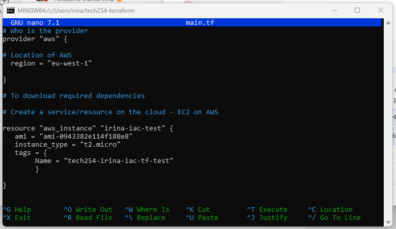

```
cat main.tf
```

8. AWS access secret keys - ENV variables on the local host.

9. Initialise Terraform:

```
terraform init
```

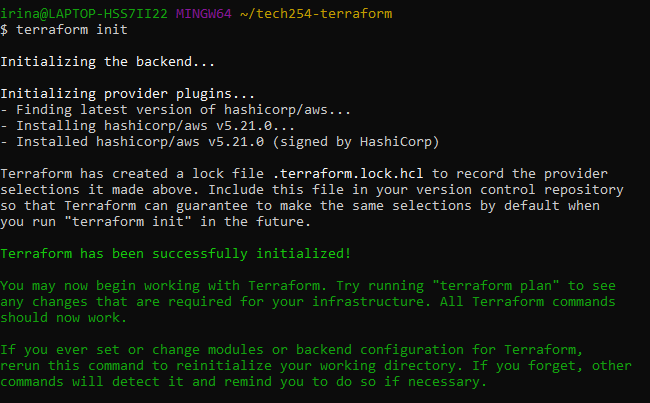

10. Compile the Terraform plan:

```shell
terraform plan
# this will compile it.
```

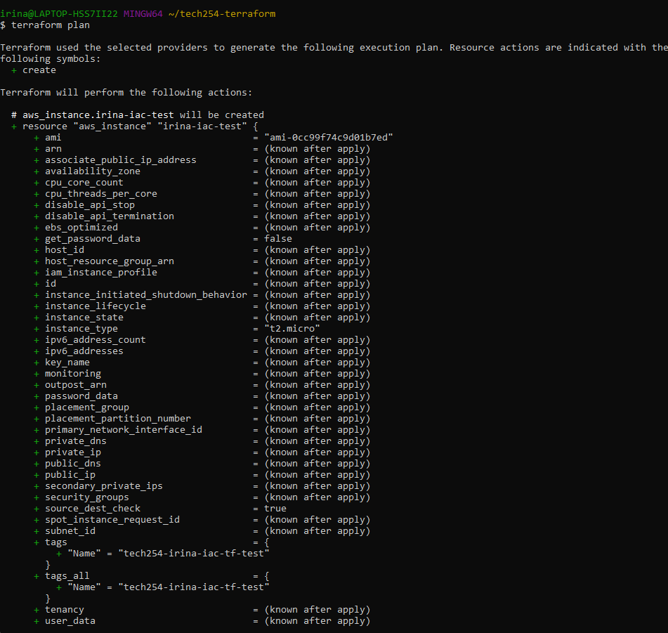

11. Apply and create the instance:

```
terraform apply
# this will run and create a resource.
```

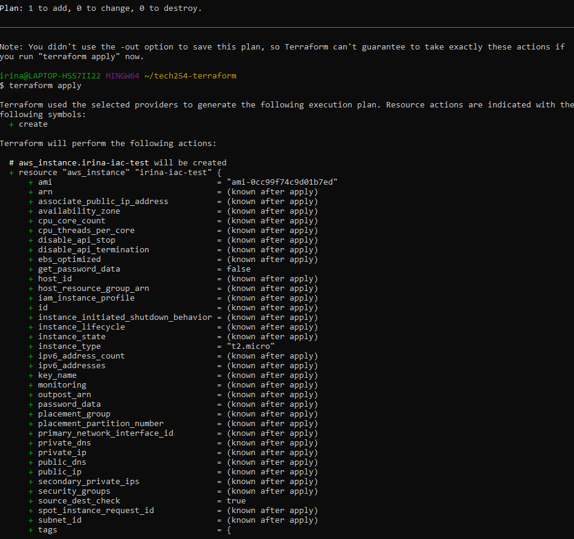

It will ask 'Are you sure?' - Enter 'yes'.

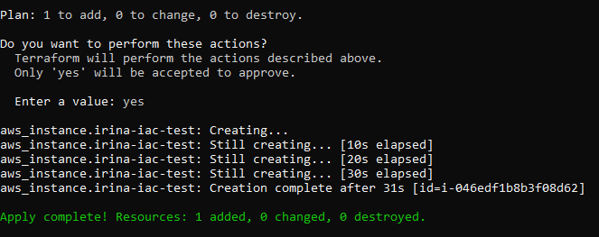

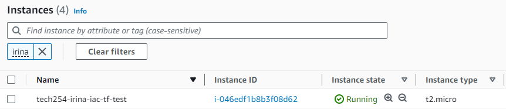


12. Deleting the instance:

```
terraform destroy
# this will delete the instance.
```
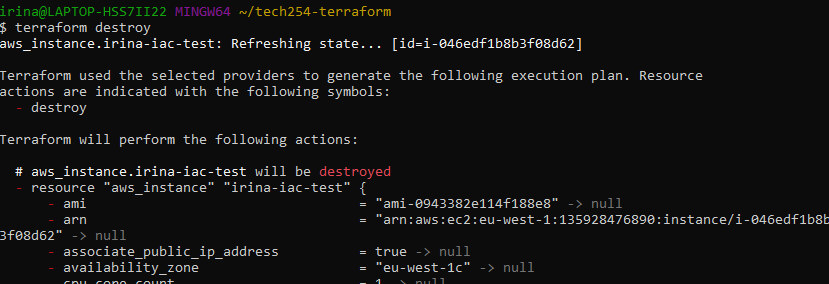

It will ask 'Are you sure?' - Enter 'yes'.

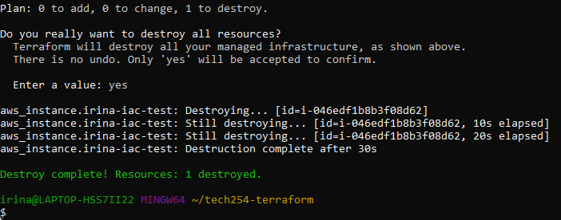

<br>

Sources:
- [Guided Steps on Installing Terraform](https://build5nines.com/install-terraform-on-windows-for-use-in-command-prompt-and-powershell/)
- [How to Create an Environment Variable in Windows](https://kb.wisc.edu/cae/page.php?id=24500)